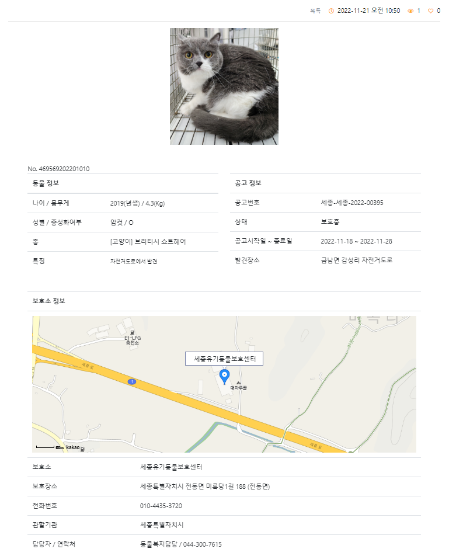
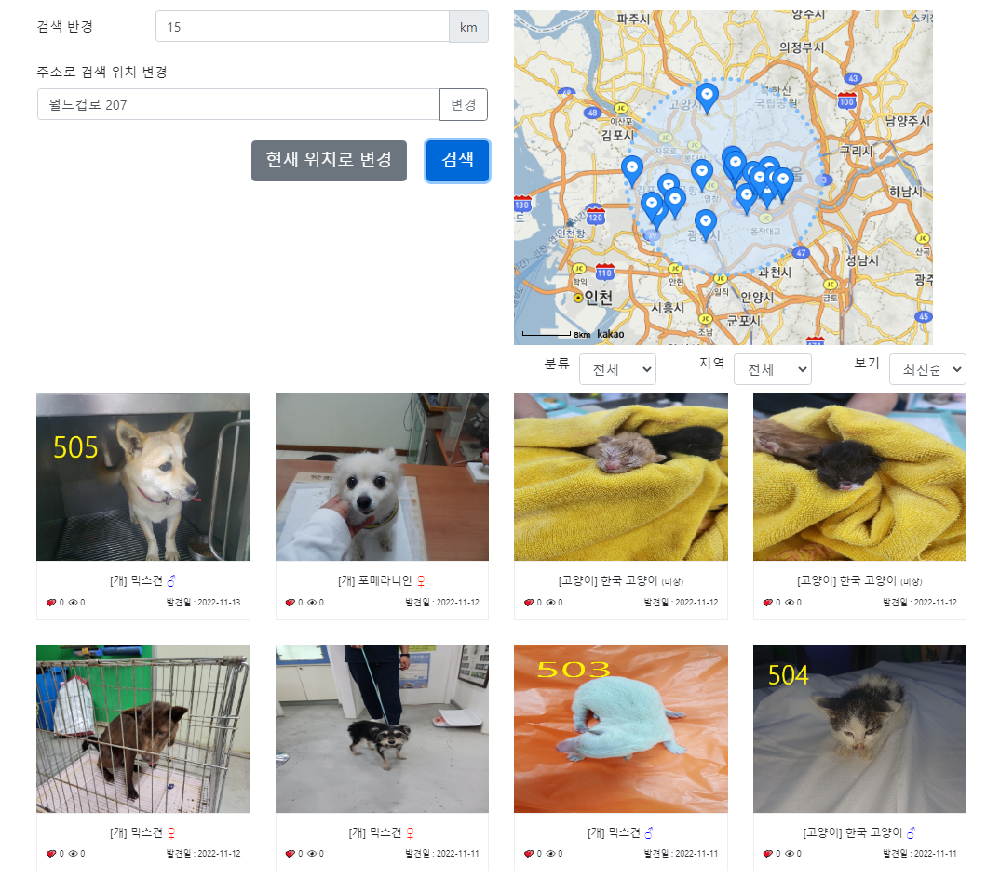
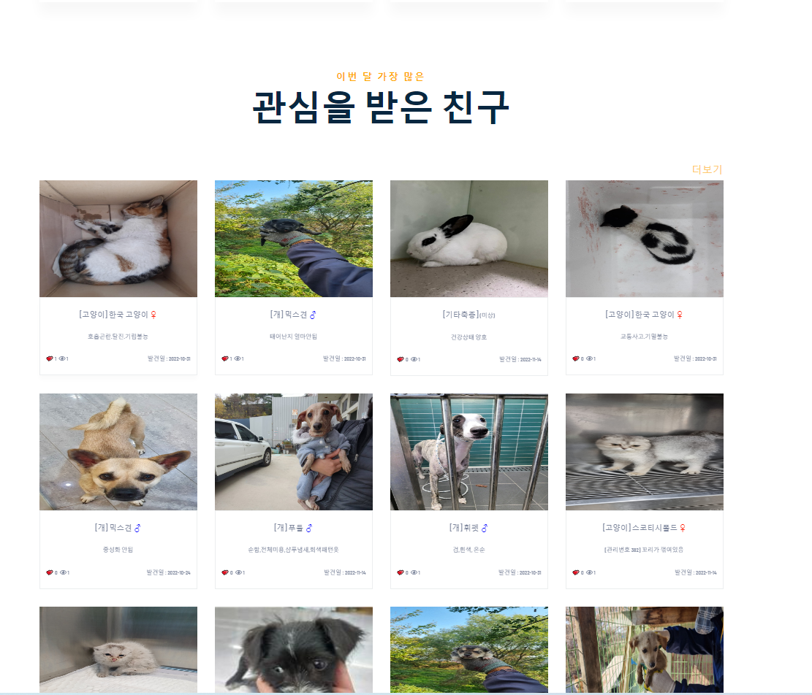
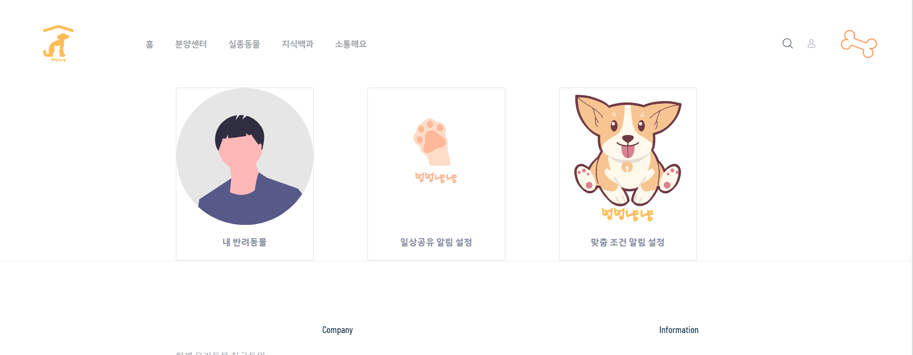
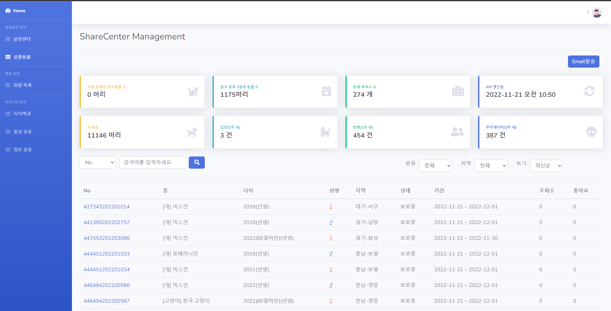
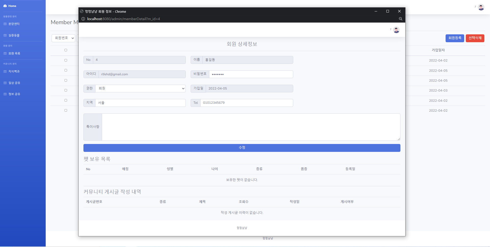
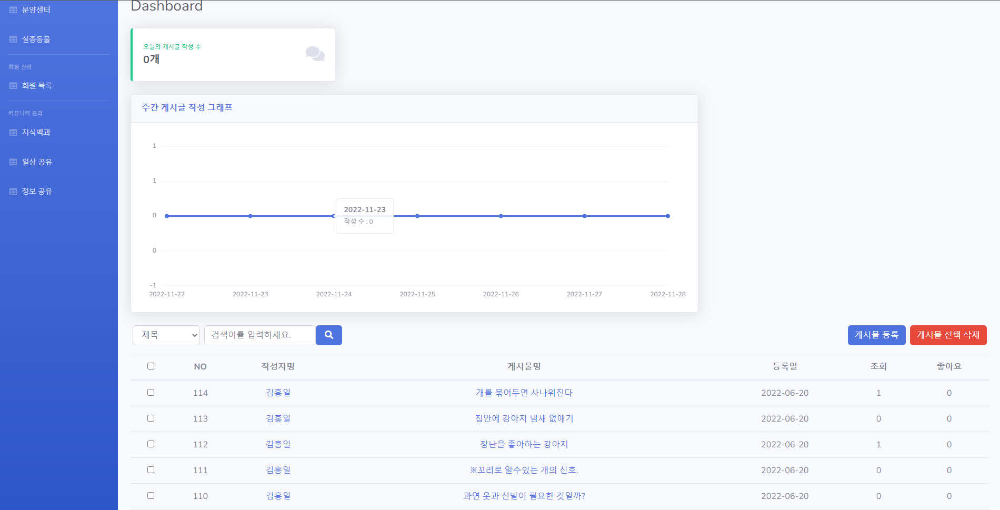

# 유기동물 분양 서비스

## 프로젝트 개요

보호소에 맡겨진 유기동물들을 쉽게 분양받을 수 있게 해주는 웹 사이트입니다.

## 개발 환경

Eclipse, Spring Framework Legacy, MariaDB, Java 1.8

## 팀원
[김요한](https://github.com/choum97)

[김홍일](https://github.com/Hoil2)

## 활용방안 및 기대효과

보호소에 맡겨진 유기동물은 보호소의 사정에 따라 안락사를 당할 수 있습니다. 이 서비스를 통해 가까운 보호소에 유기동물이 들어왔을 때 알림을 받거나 사이트에서 확인을 해서 유기동물에 대한 접근성을 높여 죽어갈 유기동물들의 수를 줄일 수 있습니다.

## 개발환경 세팅 가이드

[Environment setting guide](https://www.notion.so/hoiry/5fed02a391b1422ab233e6e5880d9650)

## 스크린샷

  
유기동물 상세화면

유기동물 지역검색

메인페이지 일부

마이페이지

관리자 분양센터

관리자 회원

관리자 커뮤니티
